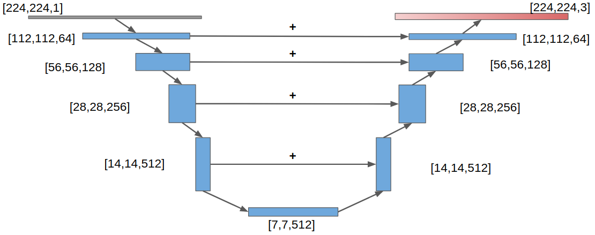
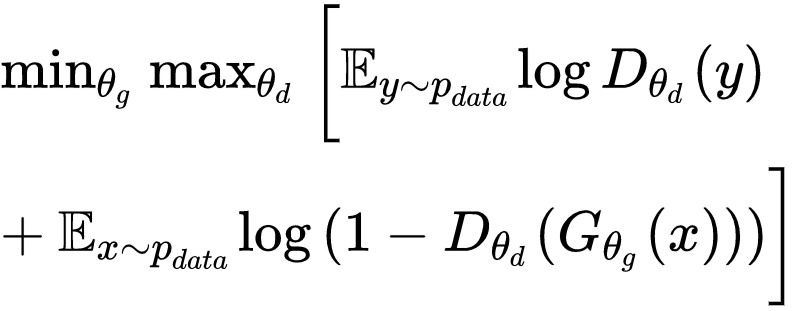
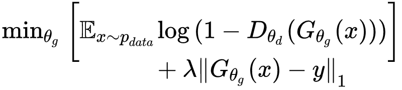

# Image Colorization using GANs

[See project report](asset/image-colorization-deep.pdf)

## Introduction
This repository is the implementation of Conditional GANs, to convert images from greyscale to RGB.
The input of the network is 1-channel greyscale image (specifically, the 'L' channel of LAB color space), and the Generator will create a 3-channel colorful version of the input image. 

The generator has an encoder-decoder architecture; the discriminator is just one encoder plus fully-connected layers which gives one-class output. Skip-connection is applied in generator (U-Net). For 224x224 images, the architecture of generator is shown below. 

Each block contains Conv(transpose Conv) layer, BatchNormalization and Leaky ReLU. Final activation function for generator is tanh; for discriminator its sigmoid. Input images are normalized before feeding into the network. 

Overall, the objective function for Conditional GAN is:

for generator, a regularization term is added using L1 distance:

where the coefficient lambda 100 is used. The model is optimized using Adam optimizer with minor changes.

The model is universal for all kinds of colorful image dataset. Three datasets are experimented here: OxFlower, SpongeBob and SC2Replay. 

* [OxFlower](http://www.robots.ox.ac.uk/~vgg/data/flowers/17/): Flower dataset generated by Oxford VGG group. It consists of 17 flower categories with 80 images for each class.

* [SpongeBob SquarePants](https://en.wikipedia.org/wiki/SpongeBob_SquarePants): The famous American animated TV series. Images from one episode are extracted and processed. 

* SC2Replay: Comes from a replay of the video game [StarCraft2](https://starcraft2.com/en-us/) from Blizzard. The replay video is a Protoss vs Zerg. Images are extracted and processed. 

## Instruction

### Prepare Dataset

#### OxFlower
Download the dataset from [VGG webpage](http://www.robots.ox.ac.uk/~vgg/data/flowers/17/). Make sure `jpg/` and `datasplits.mat` are in the same directory.

#### SpongeBob SquarePants
Download from [here (Google Drive)](https://drive.google.com/file/d/1yaSHnqFiGT2VwT373lY_E3AJpr6r9b4l/view?usp=sharing).

#### SC2Replay
Download from [here (Google Drive)](https://drive.google.com/file/d/1MHPz1a8aUwSpu3ozRjFiZuNkrDxPl8qx/view?usp=sharing).

### Training (and validation)

* Example command to train SC2 dataset:

`python gan_main.py my_path --dataset sc2 --batch_size 32 --lr 1e-3 --num_epoch 50 --lamb 100 -s --gpu 0`

Replace `my_path` by the root path of SC2 dataset. 

Image samples created during validation will be saved in `img/`; and the model will be saved in `model/` if `-s` option is used. 

### Testing

* __Testing is not implemented in this version__. But you can prepare a testing dataset and run command like:

`python gan_main.py my_path --dataset sc2 --test my_path --gpu 0`

to test the model with unseen images. Replace `my_path` by the path of the model that was saved during the training process.

## Result

Some results are displayed here. A group of 3 images is put together hozizontally. The first column is greyscale image (input); the middle column is the raw image (ground truth); the third column is generated image (output). Ideally, third column should look similar with second column. All these output images are generated on testing set. 

SC2Replay with 480x480 image size:

SpongeBob SquarePants with 224x224 image size:

OxFlower with 224x224 image size:

## Reference

* I. J. Goodfellow, J. Pouget-Abadie, M. Mirza, B. Xu,
D. Warde-Farley, S. Ozair, A. Courville, and Y. Bengio.
Generative adversarial networks. arXiv, 2014.

* M. Mirza and S. Osindero. Conditional generative adversarial
nets. CoRR, abs/1411.1784, 2014.

* O. Ronneberger, P. Fischer, and T. Brox. U-net: Convolutional
networks for biomedical image segmentation.
CoRR, abs/1505.04597, 2015.

* M.-E. Nilsback and A. Zisserman. A visual vocabulary
for flower classification. In Proceedings of the IEEE
Conference on Computer Vision and Pattern Recognition,
volume 2, pages 1447–1454, 2006.

* Q. Fu, W.-T Hsu, M.-H Yang. Colorization Using ConvNet and GAN. Stanford cs231n report: http://cs231n.stanford.edu/reports/2017/pdfs/302.pdf.
